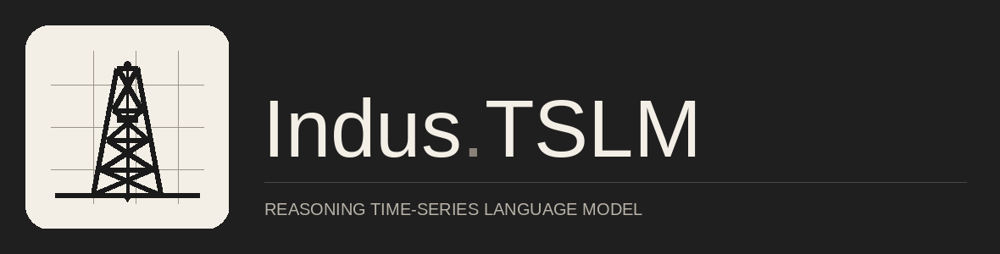
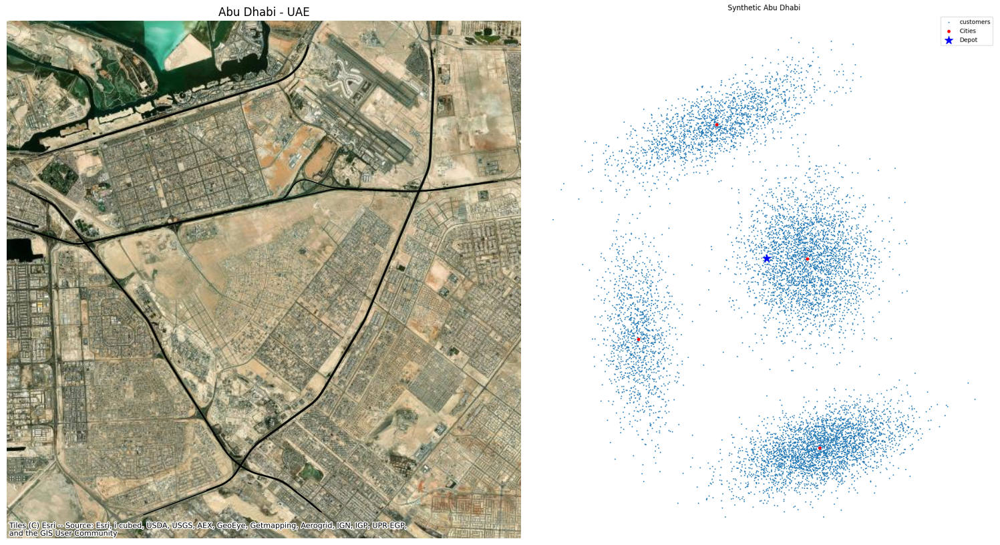

<!--SPY:START-->
## 📈 What's your next move, Chief?

  

<!--SPY:END-->

# 

## About Me
- 🎓 MSc in Machine Learning at **[MBZUAI](https://mbzuai.ac.ae/)**, advised by **Dr. Salem Lahlou** and **Dr. Martin Takáč**.
- 🛢️ Thesis research at **AIQ Intelligence (G42 / ADNOC)**, building **time series language models** that reason on long horizon industrial sensor data.
- 🧭 **Fatima Fellowship** predoctoral researcher with **Dr. M. Umar B. Niazi (MIT/KTH)** on learned observers for nonlinear control systems.
- 🍖 Outside work: **boxing**, **kayaking**, and hosting **BBQ parties**.

📖 A longer year by year walk through my research journey lives on my academic site: [**Research Background →**](https://github.com/yehias21/yehias21.github.io#-research-background)

## GitHub Stats

  
  

## 🔬 Featured Research

<table>
  <tr>
    <td width="50%" align="center">
      
       
      <a href="https://github.com/yehias21/IndusTSLM"><b>IndusTSLM</b></a>
       
      Time series language models for drilling sensor data. Contrastive dual encoder alignment (DriMM), Flamingo style cross attention, and DrillBench.
       
      <i>NeurIPS 2025 Workshop • IEEE Big Data 2025</i>
    </td>
    <td width="50%" align="center">
      
       
      <a href="https://github.com/yehias21/HyperKKL"><b>HyperKKL</b></a>
       
      Hypernetwork conditioned KKL observers for non autonomous nonlinear systems. 29% SMAPE reduction across four benchmarks under non zero input regimes.
       
      <i>ICLR 2026 Workshop • CDC 2026 (submitted)</i>
    </td>
  </tr>
  <tr>
    <td width="50%" align="center">
      
       
      <a href="https://github.com/yehias21/svrpbench"><b>SVRPBench</b></a>
       
      A realistic benchmark for the Stochastic Vehicle Routing Problem. 500+ instances (10 to 1k customers) with realistic layouts, stochastic delays, and more.
       
      <i>NeurIPS 2025 (Datasets & Benchmarks Track)</i>
    </td>
    <td width="50%" align="center">
      
       
      <a href="https://github.com/yehias21/Watermark-Analysis"><b>Watermark-Analysis</b></a>
       
      Adaptive attacks and evaluation pipeline for invisible image watermarks. 🥇 1st place on both tracks of the NeurIPS 2024 "Erasing the Invisible" challenge.
       
      <i>ICLR 2025 Workshop on GenAI Watermarking</i>
    </td>
  </tr>
</table>

## 🧩 Open Source Contributions

<table>
  <tr>
    <td width="50%" valign="middle">
      <a href="https://github.com/yehias21/flower/tree/fedpara-updated/baselines"><b>🌸 FedPara baseline in Flower</b></a>
       
      Reproducibility baseline for <i>FedPara</i> (ICLR 2022) contributed to the <a href="https://flower.ai/">Flower</a> federated learning framework during the 2023 Summer of Reproducibility at Cambridge.
    </td>
    <td width="50%" valign="middle">
      <a href="https://github.com/yehias21/FedSecAgg"><b>🔐 FedSecAgg</b></a>
       
      Personalized federated neural collaborative filtering with secure multi party computation (SMPC) aggregation, integrated into Flower. Bachelor's thesis, supervised by Dr. Ahmed Kosba.
    </td>
  </tr>
</table>
